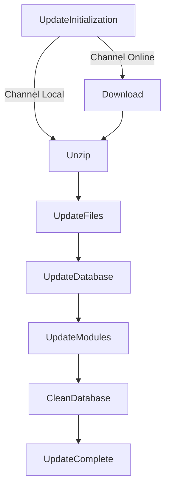
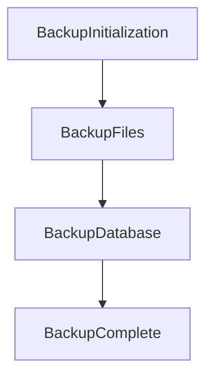
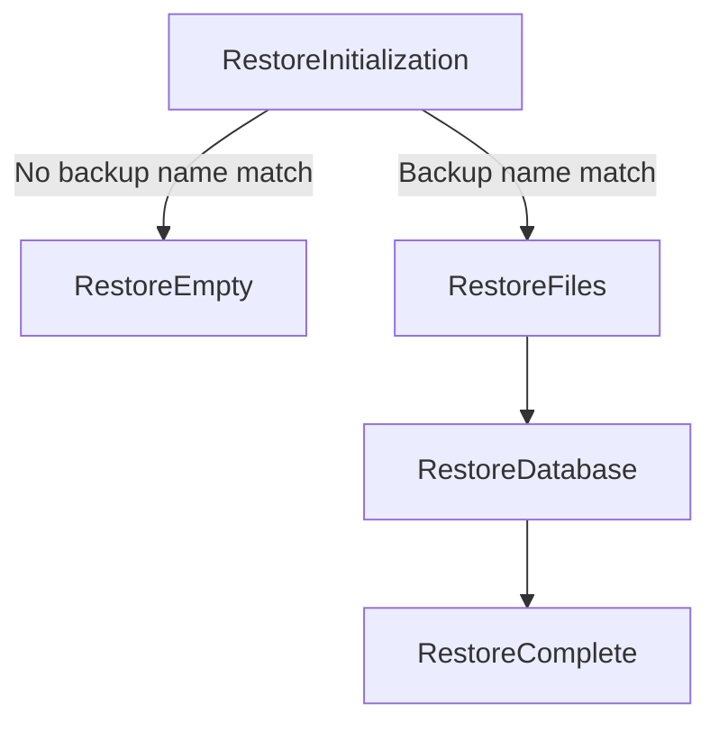

# Update assistant


[](//packagist.org/packages/PrestaShop/autoupgrade)
[](//packagist.org/packages/PrestaShop/autoupgrade)
[](https://github.com/PrestaShop/autoupgrade/LICENSE.md)

## Table of Contents

1. [About](#about)
2. [Branches](#branches)
3. [Prerequisites](#prerequisites)
4. [Installation](#installation)
    - [Create a module from source code](#create-a-module-from-source-code)
5. [Running an update on PrestaShop](#running-an-update-on-prestashop)
    - [Update with command line parameters](#update-with-command-line-parameters)
    - [Configuration file](#configuration-file)
6. [Restore a store](#restore-a-store)
    - [Restore with command line parameters](#restore-with-command-line-parameters)
7. [Channels](#channels)
8. [Configuration Parameters](#configuration-parameters)
9. [Test module updates locally](#test-module-updates-locally)
10. [Local temporary assets](#local-temporary-assets)
11. [Process steps](#process-steps)
    - [Update steps](#update-steps)
    - [Backup steps](#backup-steps)
    - [Restore steps](#restore-steps)
12. [Use Storybook for an interface overview](#use-storybook-for-an-interface-overview)
13. [Linting and Testing](#linting-and-testing)
    - [Backend](#backend)
    - [Frontend](#frontend)
14. [Documentation](#documentation)
15. [Contributing](#contributing)
    - [Reporting issues](#reporting-issues)
    - [Translations](#translations)
16. [License](#license)

## About

This module allows to update your store to a more recent version of PrestaShop. It can be used as a CLI tool or with a web assistant.
The latest versions of the module are compatible with all PrestaShop 1.7 and higher releases.

> [!IMPORTANT]  
> This module has a specific [Release Process][release-process]. If you do release a new version, make sure to follow it.

## Branches

| Branch                                                            | Status            | Docs                                    | PrestaShop Version |
|-------------------------------------------------------------------|-------------------|-----------------------------------------|--------------------|
| [master](https://github.com/PrestaShop/autoupgrade/tree/master)   | Latest (Stable)   | [Developer documentation][devdocs]      | >=1.7              |
| [dev](https://github.com/PrestaShop/autoupgrade/tree/dev)         | Latest (Unstable) | [Developer documentation][devdocs]      | >=1.7              |
| [7.0.x](https://github.com/PrestaShop/autoupgrade/tree/7.0.x)     | Bug fix only      | [Developer documentation][devdocs]      | >=1.7              |
| [6.x](https://github.com/PrestaShop/autoupgrade/tree/6.x)         | Unmaintained      | [Developer documentation][devdocs]      | >=1.7              |
| [5.x](https://github.com/PrestaShop/autoupgrade/tree/5.x)         | Unmaintained      | [Developer documentation][devdocs]      | >=1.7              |
| [4.14.x](https://github.com/PrestaShop/autoupgrade/tree/4.14.x)   | Unmaintained      | [PrestaShop 1.6 documentation][doc-1.6] | >=1.6              |

[devdocs]: https://devdocs.prestashop-project.org/9/basics/keeping-up-to-date/
[doc-1.6]: https://docs.prestashop-project.org/1-6-documentation/english-documentation/updating-prestashop/automatic-update

Branch `dev` contains code for future versions of the module, which allows updates from 1.7.x versions to higher. This is the main branch to target when opening a pull-request.

Branch `4.14.x` contains code for `4.14.x` patch versions which allow updating from 1.6.x versions to 1.7.x .

If you wish to update a store powered by PrestaShop 1.6, **please use the latest 4.14.3 version** to update to a 1.7 version.
To upgrade from PrestaShop 1.6.x to version 8.x or higher, you must do it in two steps: first, upgrade from 1.6.x to 1.7.x, then update your store using the latest version of the module to reach your target version.

Please note that PrestaShop versions 1.6 and older are no longer maintained.

## Prerequisites

* PrestaShop >= 1.7
* PHP >= 7.1
* Node.js >= 20 - [Download Node.js](https://nodejs.org/) (preference for LTS 20.11.0)

## Installation

All versions can be found in the [releases list](https://github.com/PrestaShop/autoupgrade/releases).

### Create a module from source code

If you download a ZIP archive that contains the source code or if you want to use the current state of the code, you need to build the module from the sources:

* Clone (`git clone https://github.com/PrestaShop/autoupgrade.git`) or [download](https://github.com/PrestaShop/autoupgrade/archive/master.zip) the source code. You can also download a release **Source code** ([ex. v4.14.2](https://github.com/PrestaShop/autoupgrade/archive/v4.14.2.zip)). If you download a source code archive, you need to extract the file and rename the extracted folder to **autoupgrade**
* Enter into folder **autoupgrade** and run the command `composer install`  ([composer](https://getcomposer.org/)).
* Enter into folder **autoupgrade/_dev** and run the commands `npm install` and `npm run vite:build` ([npm](https://docs.npmjs.com/)).
* Create a new ZIP archive from the of **autoupgrade** folder.
* Now you can install it in your store. For example, you can upload it using the dropzone in Module Manager back office page. 

## Running an update on PrestaShop

Updating a store can be done using:

* the configuration page of the module (browse the back office page provided by the module)
* in command line by calling `bin/console`

### Update with command line parameters

This module provide a powerful command-line interface based on Symfony Console, allowing you to execute various commands
to manage your store. You can use this interface to perform updates, restores, and check system requirements.

To use the Symfony Console, simply run the following command from the root directory of autoupgrade module:

```
$ php bin/console
```

The requirements can be reviewed to confirm the store is safe to update:

```
$ php bin/console update:check <your-admin-dir>
```

A backup of the store is created with:

```
$ php bin/console backup:create --config-file-path=[/path/to/config.json] <your-admin-dir>
```

The update process can be launched with:

```
$ php bin/console update:start --config-file-path=[/path/to/config.json] --chain <your-admin-dir>
```

You can see all available parameters and options directly from the console by using the `--help` option with any command.

For more information on using commands, please refer to the [PrestaShop developer documentation](https://devdocs.prestashop-project.org/8/basics/keeping-up-to-date/upgrade-module/upgrade-cli/)

### Configuration file

For the proper functioning of the update process via the console, it is necessary to provide a configuration file in JSON format.

Here is an example of the different fields that can be found in it:

```json
{
  "channel": "local",
  "archive_zip": "prestashop_8.0.0.zip",
  "archive_xml": "prestashop_8.0.0.xml",
  "PS_AUTOUP_CUSTOM_MOD_DESACT": 1,
  "PS_AUTOUP_CHANGE_DEFAULT_THEME": 0,
  "PS_AUTOUP_REGEN_EMAIL": 1,
  "PS_AUTOUP_KEEP_IMAGES": 1,
  "PS_DISABLE_OVERRIDES": 1
}
```

Please see the section [Configuration Parameters](#configuration-parameters) for explanations concerning the configurations

## Restore a store

If an error occurs during the update process, the restore will be suggested.
In case you lost the page from your backoffice, note it can be triggered via CLI.

### Restore with command line parameters

For restore your store, you would use:

```
$ php bin/console backup:restore --backup=[backup-name] <your-admin-dir>
```

You can see all available parameters and options directly from the console by using the `--help` option with any command.

For more information on using commands, please refer to the [PrestaShop developer documentation](https://devdocs.prestashop-project.org/8/basics/keeping-up-to-date/upgrade-module/upgrade-cli/#rollback-cli)

## Channels

There are 2 channels available for an update:

* `online` - This channel corresponds to the official "online" update for your store, detected by PrestaShop APIs (major, minor or patch versions). This update is the most recent version of PrestaShop compatible with the PHP version of your server.
* `local` - This channel corresponds to the “local” update, displaying customized updates detected inside your server `[your-admin-dir]/autoupgrade/download` folder (based on .ZIP and .XML files).

## Configuration Parameters

When using the command line interface (CLI), you can configure the module's behavior through a JSON file or by passing
parameters directly via CLI. Below is a detailed description of the available parameters, including their data types and
impact.

| Command                                     | Configuration file key                        | CLI option                     | Possible Values                                                                         | Description                                                                                                                                   |
|---------------------------------------------|-----------------------------------------------|--------------------------------|-----------------------------------------------------------------------------------------|-----------------------------------------------------------------------------------------------------------------------------------------------|
| `update:start`                              | `channel`                                     | `--channel`                    | `online` (default), `local`                                                             | Defines the update channel to use. The `local` channel requires specific files to be placed in the download folder.                           |
| `update:start`, `update:check-requirements` | `archive_zip`                                 | `--zip`                        | Valid file name                                                                         | Name of the `ZIP` file to use for an update via the archive channel. This file must be placed in `[your-admin-dir]/autoupgrade/download`.     |
| `update:start`, `update:check-requirements` | `archive_xml`                                 | `--xml`                        | Valid file name                                                                         | Name of the `XML` file corresponding to the ZIP file for the archive channel. Must also be placed in `[your-admin-dir]/autoupgrade/download`. |
| `update:start`                              | `PS_AUTOUP_CUSTOM_MOD_DESACT`                 | `--disable-non-native-modules` | `true` (default), `false`, `'true'`, `'false'`, `'1'`, `'0'`, `1`, `0`, `'on'`, `'off'` | If enabled, disables all non-native modules before the update, reducing the risk of compatibility issues.                                     |
| `update:start`                              | (DEPRECATED) `PS_AUTOUP_CHANGE_DEFAULT_THEME` | no option available            | `true`, `false` (default), `'true'`, `'false'`, `'1'`, `'0'`, `1`, `0`, `'on'`, `'off'` | If enabled, forces the use of the default PrestaShop theme after the update. If disabled, retains the current theme.                          |
| `update:start`                              | `PS_AUTOUP_REGEN_EMAIL`                       | `--regenerate-email-templates` | `true` (default), `false`, `'true'`, `'false'`, `'1'`, `'0'`, `1`, `0`, `'on'`, `'off'` | If enabled, keeps the store's customized email templates. Otherwise, the templates are replaced with the default ones.                        |
| `update:start`                              | `PS_DISABLE_OVERRIDES`                        | `--disable-all-overrides`      | `true` (default), `false`, `'true'`, `'false'`, `'1'`, `'0'`, `1`, `0`, `'on'`, `'off'` | If enabled, disables all PHP overrides in PrestaShop, ensuring better compatibility during the update process.                                |
| `backup:create`                             | `PS_AUTOUP_KEEP_IMAGES`                       | `--include-images`             | `true` (default), `false`, `'true'`, `'false'`, `'1'`, `'0'`, `1`, `0`, `'on'`, `'off'` | If enabled, retains all images in the backup. This operation can take a long time depending on the storage of your images                     |
| `backup:restore`                            | no option available                           | `--backup`                     | Valid file name                                                                         | Specify the backup name to restore. The allowed values can be found with backup:list command)                                                 |
| `backup:delete`                             | no option available                           | `--backup`                     | Valid file name                                                                         | Specify the backup name to delete. The allowed values can be found with backup:list command)                                                  |

## Test module updates locally

During the update process, we check for new module versions on the PrestaShop Marketplace. If a new version is found, it is downloaded and installed automatically.

However, to test the update process without publishing the module to the Marketplace (which can be inconvenient for developers), you can use a local version of your module. Here’s how:

1. Create a ZIP archive of your module.
2. Place the ZIP file in the following directory: `[your-admin-dir]/autoupgrade/modules/MODULE_NAME.zip`.

This will make the update process use your local archive instead of downloading the latest version from the Marketplace.

⚠️ Note: If your local module archive is invalid, the updater will fall back to downloading the latest available version from the Marketplace.

## Local temporary assets

In order to work properly, the Update module needs to write some files to your filesystem server. These files are stored in the following folders, all available in the `[your-admin-dir]/autoupgrade` path.

```
 [your-admin-dir]/autoupgrade/
 ├── download/              Directory for XML and ZIP archives for local updates.
 ├── modules/               Folder where you can put an archive of a module. This one will be used when updating modules.
 ├── tmp/
 │   ├── files/             Working directory of the autoupgrade. This is where the destination version of PrestaShop will be unziped, before copy.
 │   ├── releases/          Stores downloaded releases in online mode, emptied at the end of the update process
 │   ├── modules/           Stores module zip files and migration scripts, emptied at the end of the update process.
 ```

## Process steps

Here you will find the list of actions done during the processes.

### Update steps



The following steps will be executed during the update:

1. **UpdateInitialization**: Start of the whole process, clear potential leftover temporary files from a previous process. The next step will be chosen depending on the configuration.
2. **Download**: Download the appropriate archive for your PHP version.
3. **Unzip**: Unzip the downloaded archive.
4. **UpdateFiles**: Now the current content is saved, it can alter the store content. This step will run several time. The first call will initialize the files list, then the next ones will copy a part of this list.
5. **UpdateDatabase**: This step runs all the update SQL files available for the destination version. Then, it will run some additional steps, such as cache deletion, language update…
6. **UpdateModules**: This step updates the modules and executes potential migrations from local sources, composer or from the Prestashop marketplace.
7. **CleanDatabase**: This step run some SQL queries in order to remove obsolete or wrong data. Note the concerned data is not coming from the update itself, but from the use of PrestaShop.
8. **UpdateComplete**: This step will display a success message, clear temporary files and will end the process.

### Backup steps



The following steps will be executed during the backup:

1. **BackupInitialization**: Start of the whole process, clear potential leftover temporary files from a previous process.
2. **BackupFiles**: Backup store files, including or not images depending on the configuration.
3. **BackupDatabase**: It saves the current database structure and content.
4. **BackupComplete**: This step will display a success message, clear temporary files and will end the process.

### Restore steps



The following steps will be executed during the restore:

1. **RestoreInitialization**: Start of the whole process, clear potential leftover temporary files from a previous process.
2. **RestoreEmpty**: A classic step used to display a message saying no backup matches the given parameters, and terminates the process.
3. **RestoreFiles**: Like the step **UpdateFiles**, this step copies the files from the archive and remove the files missing from the original environment.
4. **RestoreDatabase**: This step reads and runs the files generated by **BackupDatabase**.
5. **RestoreComplete**: This step will display a success message, clear temporary files and will end the process.

## Use Storybook for an interface overview

The [Storybook folder](/storybook) contains a project allowing you to use Storybook to have an overview of the project interface under different versions of PrestaShop.

More information on the project [README](/storybook/README.md).

## Linting and Testing

This section outlines all the commands for code linting and testing. Before running these, ensure you've followed the project setup steps and installed all dependencies.

### Backend

All backend commands should be executed from the root directory.

- `./tests/phpstan/phpstan.sh [version]` ⮕ Runs **PHPStan**, a tool for static code analysis to identify potential errors in your PHP code (requires running a `composer install` in the `tests` folder). Available version options:
    - `1.7.2.5`
    - `1.7.3.4`
    - `1.7.4.4`
    - `1.7.5.1`
    - `1.7.6`
    - `1.7.7`
    - `1.7.8`
    - `8.0.0`
    - `latest`

- `./vendor/bin/phpunit ./tests/unit/` ⮕ Runs **PHPUnit**, a framework for running unit tests on your PHP code. You can modify the path to target specific test files.

- `./vendor/bin/php-cs-fixer` ⮕ Runs **PHP CS Fixer**, a tool that ensures your PHP code follows the correct coding standards. Add the `fix` option to automatically resolve fixable style issues.

### Frontend

All frontend commands should be executed from the `_dev` directory.

- `npm run lint` ⮕ Runs **ESLint** and **Prettier** to perform static code analysis and automatic formatting of your JavaScript code. Add `:fix` to the command to automatically fix fixable issues.

- `npm run stylelint` ⮕ Runs **Stylelint** to lint and format your SCSS files. You can append `:fix` to automatically resolve solvable formatting issues.

## Documentation

* Documentation is hosted on [the Developer documentation][doc].
* Privacy documentation is hosted [on the PrestaShop Project website][prestashop-privacy].

## Contributing

PrestaShop modules are open source extensions to the [PrestaShop e-commerce platform][prestashop]. Everyone is welcome and even encouraged to contribute with their own improvements!

Just make sure to follow our [contribution guidelines][contribution-guidelines].

### Reporting issues

You can report issues with this module in the main PrestaShop repository. [Click here to report an issue][report-issue].

### Translations

Wording can be translated into the [Crowdin project](https://crowdin.com/editor/prestashop-official-modules/41846).

## License

This module is released under the [Academic Free License 3.0][AFL-3.0]

[report-issue]: https://github.com/PrestaShop/PrestaShop/issues/new/choose
[prestashop]: https://www.prestashop-project.org/
[prestashop-privacy]: https://www.prestashop-project.org/data-transparency/
[contribution-guidelines]: https://devdocs.prestashop-project.org/8/contribute/contribution-guidelines/project-modules/
[AFL-3.0]: https://opensource.org/licenses/AFL-3.0
[doc]: https://devdocs.prestashop-project.org/8/basics/keeping-up-to-date/upgrade-module/
[release-process]: https://www.prestashop-project.org/maintainers-guide/processes/release/autoupgrade/
